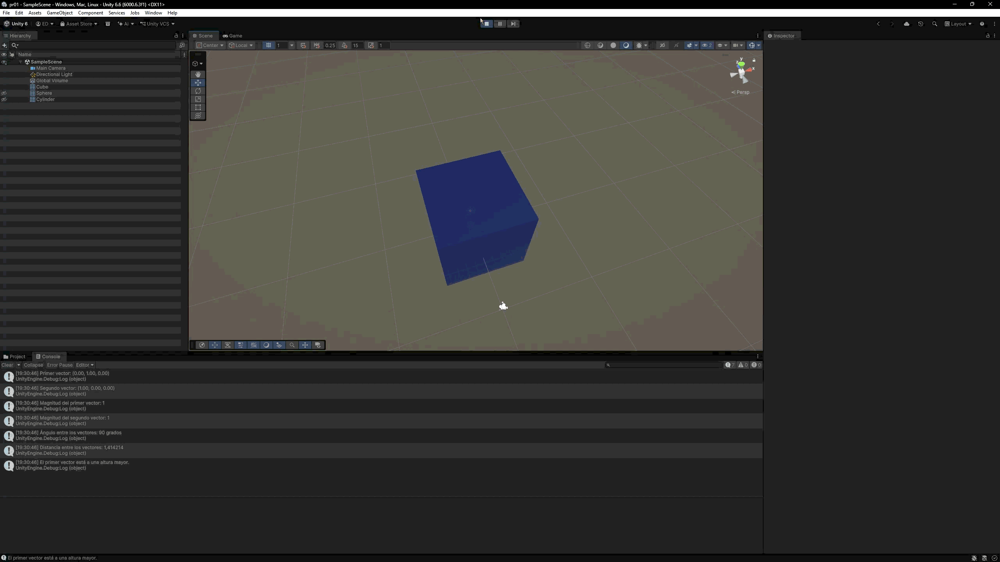
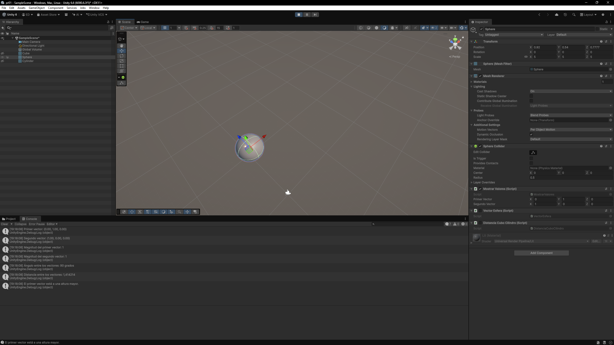

# Práctica 1: Introducción C# - Scripts

Esta práctica contiene cuatro ejercicios independientes. Cada script se
adjunta a un GameObject de la escena y muestra el resultado en la escena o en
la consola de Unity.

## Índice

1. [Cambio de color aleatorio](#1-cambio-de-color-aleatorio)
2. [Operaciones con dos vectores](#2-operaciones-con-dos-vectores)
3. [Posición de una esfera](#3-posicion-de-una-esfera)
4. [Distancia entre cubo y cilindro](#4-distancia-entre-cubo-y-cilindro)

## Ejercicios

### 1. Cambio de color aleatorio

Archivo: [CambioColor.cs](CambioColor.cs)

El script obtiene el componente `Renderer` del objeto, genera un color aleatorio
al comenzar la ejecucion y lo aplica al material. Despues, cada cierto numero
de frames (`framesEntreCambios`, 120 por defecto), genera y aplica un nuevo
color.

[Volver al índice](#índice)

### 2. Operaciones con dos vectores

Archivo: [MostrarValores.cs](MostrarValores.cs)

Al iniciar la escena, el script muestra en la consola los dos vectores, sus
magnitudes, el angulo que forman y la distancia entre ellos. Finalmente,
compara sus coordenadas `y` para indicar cual esta a mayor altura.

[Volver al índice](#índice)

### 3. Posicion de una esfera

Archivo: [VectorEsfera.cs](VectorEsfera.cs)

El script obtiene la posicion del objeto que contiene el componente y la
registra en la consola en cada frame. Para esta prueba, el objeto debe ser una
esfera y puede moverse para comprobar que la posicion registrada se actualiza.

[Volver al índice](#índice)

### 4. Distancia entre cubo y cilindro

Archivo: [DistanciaCuboCilindro.cs](DistanciaCuboCilindro.cs)

El script localiza los objetos con las etiquetas `Cube` y `Cylinder` y calcula
en cada frame la distancia desde el objeto que contiene el script hasta cada
uno de ellos. Los resultados se muestran en la consola de Unity.

[Volver al índice](#índice)
